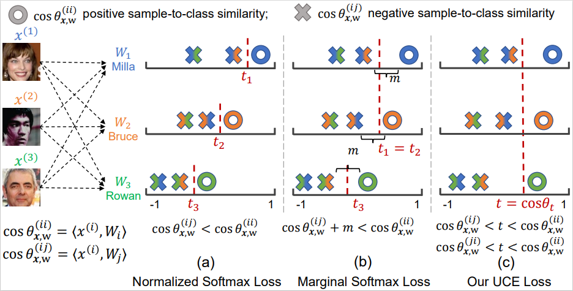

## Introduction

UniFace: Unified Cross-Entropy Loss for Deep Face Recognition

UnitFace,the face recognition model trained with the proposed UCE loss.

<div align="center">
  
</div>


## Ablation study
| Loss                          |   UT   |   $m$  | $\lambda$ |   $r$  |     MR-All     |      IJB-C     |       LFW      |
|-------------------------------|:------:|:------:|:---------:|:------:|:--------------:|:--------------:|:--------------:|
| $L_{\text{sl}}$               | \xmark | \xmark |   \xmark  | \xmark |      18.52     |      71.53     |      98.30     |
| $L_{\text{bce}}$              | \xmark | \xmark |   \xmark  | \xmark |      18.90     |      69.68     |      98.68     |
| $L_{\text{uce}}$              | \cmark | \xmark |   \xmark  | \xmark |      19.59     |      74.80     |      98.45     |
| $L_{\text{sl-m}}$             | \xmark | \cmark |   \xmark  | &#10005; |      41.80     |      46.17     |      99.50     |
| $L_{\text{bce-m}}$            | \xmark | \cmark |   \xmark  | &#10006; |      45.35     |      83.88     |      99.46     |
| $L_{\text{uce-m}}$            | \cmark | \cmark |   \xmark  | &#10007; |      47.45     |      88.65     |    **99.56**   |
| $L_{\text{uce-mb-}{\lambda}}$ | \cmark | &#10003; |  &#10003; | &#10008; |      48.54     |    **88.96**   |      99.55     |
| $L_{\text{uce-mb-}{r}}$       | \cmark | \cmark |   \xmark  | \cmark |    **48.72**   |      88.94     |      99.30     |


## Get started

1. **Prepare dataset**

    Download [CASIA-Webface](https://drive.google.com/file/d/1KxNCrXzln0lal3N4JiYl9cFOIhT78y1l/view?usp=sharing) preprocessed by [insightface](https://github.com/deepinsight/insightface/blob/master/recognition/_datasets_/README.md).

2. **Train model**
    ```console
    unzip faces_webface_112x112.zip
    ```
    Modify the 'data_path' in train.py (Line 56)

    Select and uncomment the 'loss' in backbone.py (Line 67)
    ```console
    python train.py
    ```

3. **Test model**
    ```console
    python pytorch2onnx.py
    zip model.zip model.onnx
    ```
    Upload model.zip to MFR Ongoing

## Citation

If you find **UniFace** useful in your research, please consider to cite:

  ```bibtex
  @InProceedings{UniFace,
	title = {UniFace: Unified Cross-Entropy Loss for Deep Face Recognition},
	author = {Jiancan Zhou, Xi Jia, Qiufu Li, Linlin Shen, Jinming Duan},
	booktitle = {ICCV},
	year = {2023}
  }
  ```
